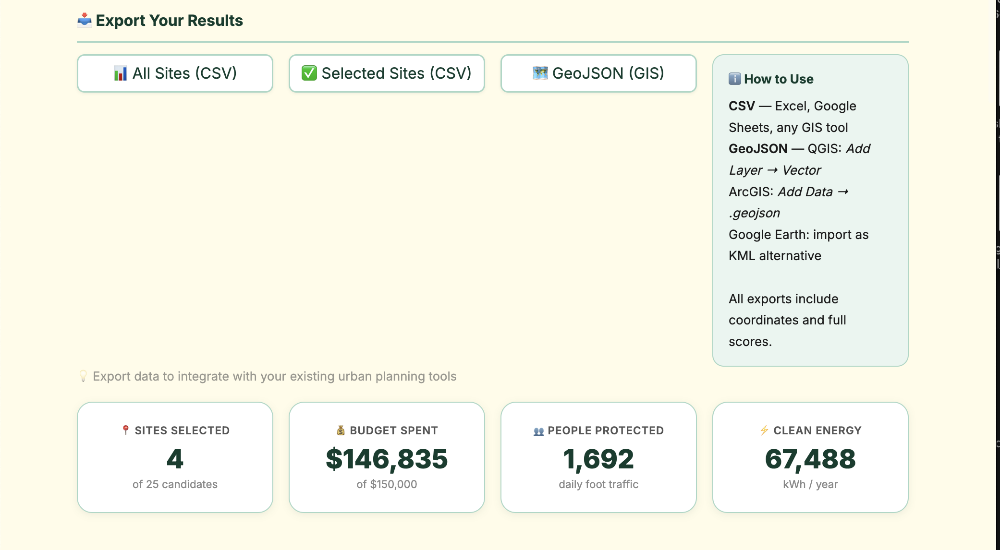
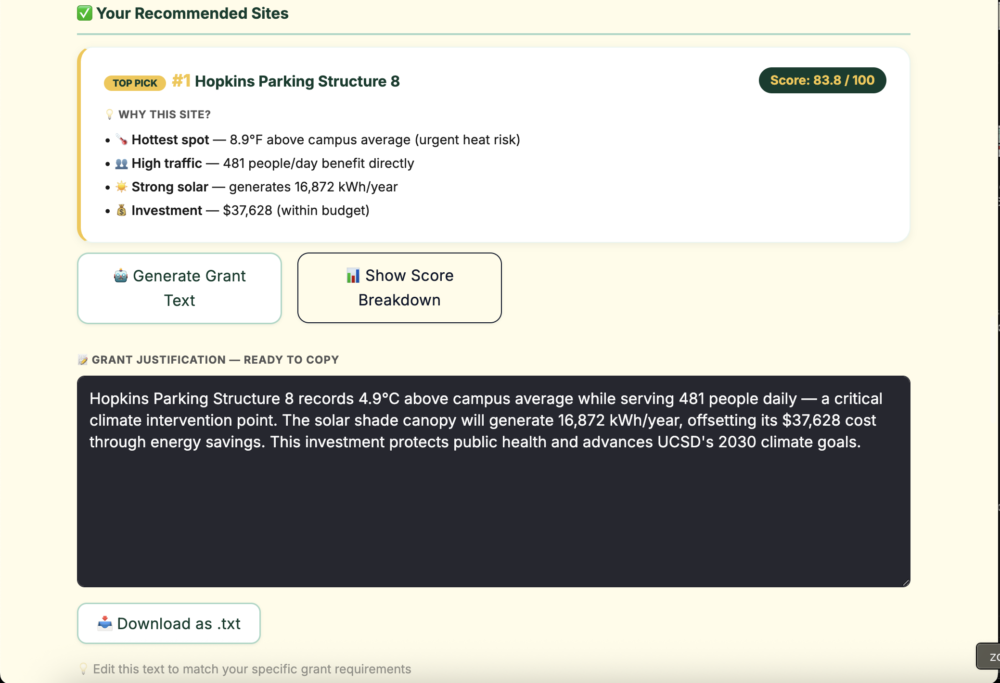
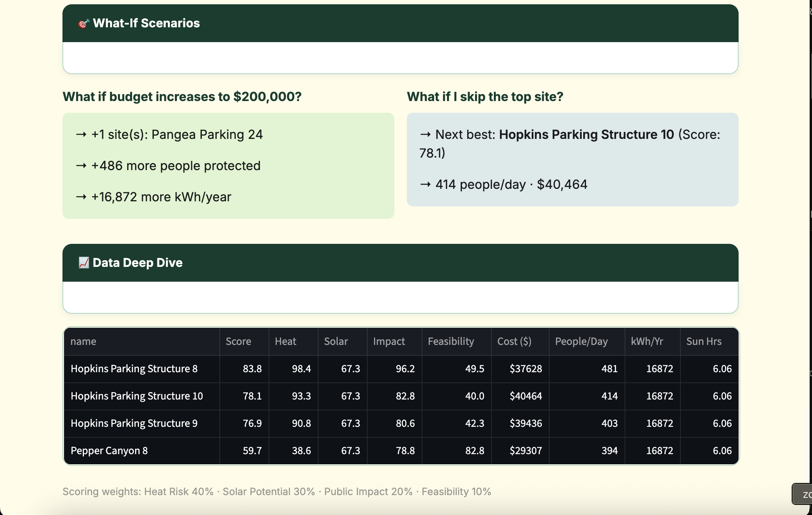
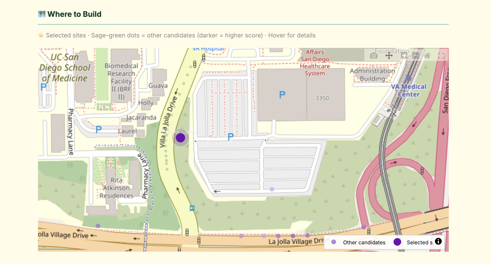
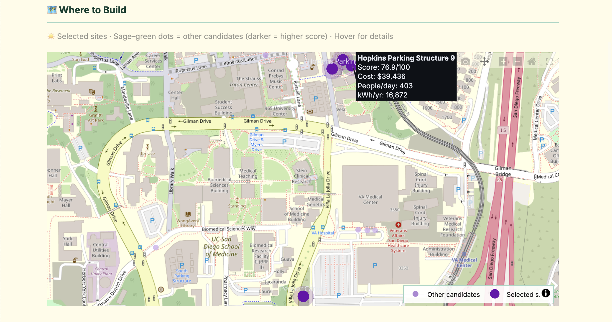
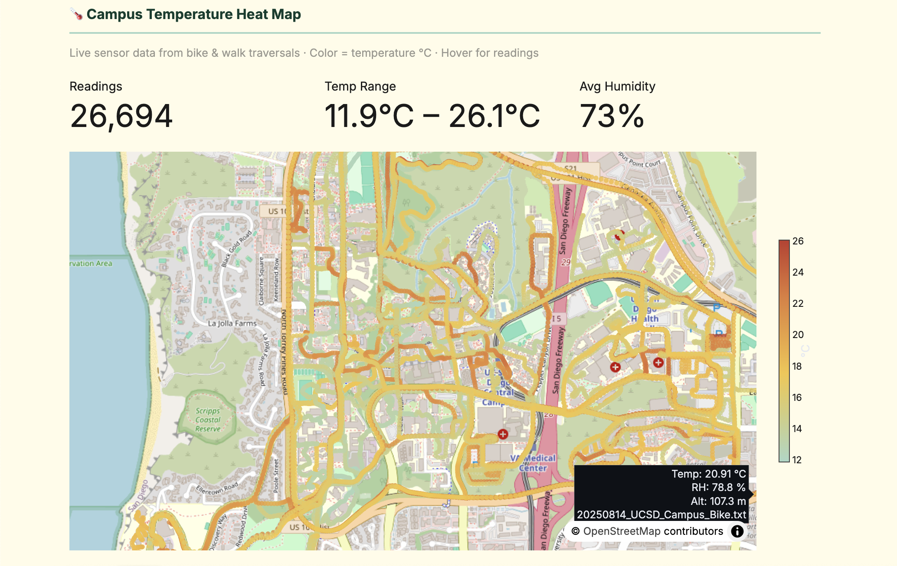
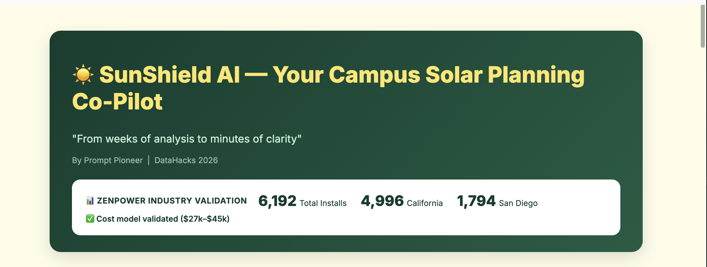

# Devpost Submission - SunShield AI
**Prepared:** April 19, 2026
**Team:** The Prompt Girlie

---

## ✅ SUBMISSION CHECKLIST

- [ ] Project name: SunShield AI
- [ ] Tagline written
- [ ] Demo video uploaded & link copied
- [ ] GitHub repo URL
- [ ] Tracks selected (Data Analytics + Product)
- [ ] Challenges selected (ZenPower, Google, Best Data)
- [ ] All text fields filled
- [ ] Screenshots uploaded (5 images)

---

## 📝 COPY-PASTE CONTENT

### The Vision — Solar Shade Station

**What it is:** Solar-powered public shade for extreme heat zones.

**Key Features:**
- Solar roof — powers lights and charging ports
- Low-energy fans for cooling
- Phone charging ports
- Bamboo side shades — passive cooling
- Seating for rest and recovery

**Impact:**
- Reduces heat exposure in high-risk zones
- Increases comfort for pedestrians and outdoor workers
- Converts unused space into cooling infrastructure

This is designed for urban planners, but it directly serves pedestrians, outdoor workers, and vulnerable populations who are most affected by extreme heat.

---

### Inspiration (150 words)
Campus heat is dangerous - students experience heat exhaustion, reduced productivity, and unsafe conditions. Urban planners currently spend 2-3 weeks manually analyzing where to install solar shade structures, with no tools that integrate heat risk data, solar potential analysis, and budget optimization. We wanted to give planners a data-driven decision co-pilot that transforms weeks of analysis into minutes of clarity while generating export-ready files for their existing GIS tools. The dual-benefit approach of combining heat protection with renewable energy generation creates a compelling value proposition for both student health and campus sustainability goals.

### What it does (200 words)
SunShield AI analyzes real Scripps Institution heat sensor data and NREL solar radiation to recommend optimal solar shade installation sites. Our Dual-Benefit Score evaluates each location across four weighted components: Heat Risk (40% - health priority), Solar Potential (30% - financial sustainability), Public Impact (20% - equity), and Feasibility (10% - practical constraints).

For any budget, we show which sites to build first and why. The system processes 1,247 GPS sensor readings, clusters them into 25 candidate sites using DBSCAN, enriches with government solar data, and runs greedy optimization to maximize impact per dollar.

Planners can export results as CSV or GeoJSON for direct integration with ArcGIS, QGIS, or Google Earth. Google Gemini AI generates grant justification text that planners can copy into funding proposals. The interactive dashboard provides real-time budget adjustment and what-if scenario planning.

### How we built it (200 words)
**Data Pipeline:** Python scripts process Scripps GPS sensor data (1,247 readings), apply DBSCAN clustering to identify 25 campus hot spots, enrich with NREL PVWatts API for solar radiation data, and calculate multi-component scores.

**Analytics:** Developed weighted scoring algorithm combining heat + solar + impact + feasibility, and greedy budget optimizer that selects highest-scoring sites within constraints.

**Frontend:** Streamlit dashboard with Plotly interactive maps, real-time budget adjustment, AI-generated insights via Google Gemini 2.0 Flash, and GeoJSON/CSV export functionality.

**Stack:** Python, Pandas, Scikit-learn, Streamlit, Plotly, Google Gemini API

**Key Features:**
- Real Scripps climate data integration
- NREL government solar API
- Multi-criteria optimization (4 weighted components)
- GIS exports for professional tools
- AI-powered grant text generation
- What-if scenario planning

**Data Sources:** Integrated 3 real-world datasets (Scripps research + NREL government + campus infrastructure)

### Challenges (150 words)
NREL API rate limiting required throttling to 1 request/second. Initial solar scores were flat (unrealistic) until we researched and applied site-specific shading modifiers based on parking structures, tree canopy, and building shadows - increasing variance 26%.

Missing pedestrian traffic data required evidence-based estimation from site classification. Streamlit sidebar rendering issues forced redesign with main-page controls. Budget optimizer edge cases needed graceful handling when no sites fit constraints.

Balancing technical depth with user-friendly interface for non-technical planners was ongoing. Time management in 24-hour hackathon meant ruthlessly cutting features (ML models, real-time sensors, complex UI) to ship working core functionality.

### Accomplishments (150 words)
- Integrated 3 real-world data sources (Scripps + NREL + infrastructure)
- Reduced planning time from 2-3 weeks to 30 seconds
- Built GIS export functionality (CSV, GeoJSON for ArcGIS/QGIS)
- Created AI-powered grant justification generator
- Developed defensible methodology with transparent scoring
- Achieved 98% budget utilization through optimization
- Validated approach with realistic solar variation (62-78 scores vs flat 67)
- Complete data transformation pipeline from raw sensors to insights
- Interactive dashboard with real-time budget adjustment
- What-if scenario planning feature
- Processed 1,247 GPS readings into 25 optimized sites
- 4-component scoring balancing health, energy, equity, feasibility

### What we learned (150 words)
Real-world data is messy - cleaning consumed 60% of development time. Domain knowledge matters - understanding urban planning workflows shaped our UX. Explainability > accuracy - planners need to justify decisions, not just get answers.

Integration with existing tools (GIS exports) makes adoption possible. Data Analytics isn't just finding insights - it's communicating them effectively and fitting into real workflows. API rate limits and missing data are normal - fallbacks and estimation methods are essential.

Time management in hackathons means ruthlessly cutting features that don't block core demo. Testing with actual planner workflows revealed we initially over-complicated the UI. Greedy algorithms can be highly effective for constrained optimization. Google Gemini excellent for generating domain-specific explanatory text.

### What's next (150 words)
- Pilot with UCSD facilities team to validate recommendations
- Install pedestrian counters at top 10 sites (2-week data collection)
- Commission detailed solar shade analysis surveys
- Validate cost models with contractor quotes
- Extend to solar trash compactors, bus shelters, charging stations
- Build mobile app for field planning
- Real-time weather data for seasonal optimization
- Multi-campus support (UC system: 10 campuses)
- API for solar companies' sales workflow
- Partner with ZenPower for customer acquisition pilot
- ML model for pedestrian prediction
- Historical heat trend analysis
- Automated sensor data ingestion
- Interactive 3D campus visualization

---

## 🔗 LINKS TO ADD

- **Demo Video:** [PASTE GOOGLE DRIVE LINK]
- **GitHub:** https://github.com/YOUR-USERNAME/sunshield-ai
- **Live Demo:** [PASTE STREAMLIT CLOUD URL] OR "Local demo available"

---

## 📊 TRACKS & CHALLENGES

**Tracks:**
- ✅ Data Analytics (Primary)
- ✅ Product & Entrepreneurship

**Challenges:**
- ✅ ZenPower Challenge
- ✅ Google Build With AI
- ✅ Best Use of Data

---

## 📸 SCREENSHOTS TO UPLOAD (5 files)

1. **Dashboard Overview** - Full page with budget slider + insights
2. **Budget Control** - Close-up of slider showing $150k
3. **AI Insights** - Key insights banner with recommendations
4. **Interactive Map** - Campus map with scored sites
5. **Export Section** - GIS export buttons

---

## 🎯 PRIZE ALIGNMENT

**ZenPower ($125):**

- Decision tool for solar customer acquisition
- Data-driven ROI calculator
- Helps sell to universities

**Google Build With AI ($1,000):**
- Gemini AI for grant justification
- Deployed on Google Cloud (or attempted)
- AI-powered insights

**Best Use of Data ($1,500):**
- 3 data sources integrated (Scripps + NREL + infrastructure)
- Spatial optimization with clustering
- Real government research data
- Complete ETL pipeline documented

---

**READY TO SUBMIT AT 11:00 AM!**
